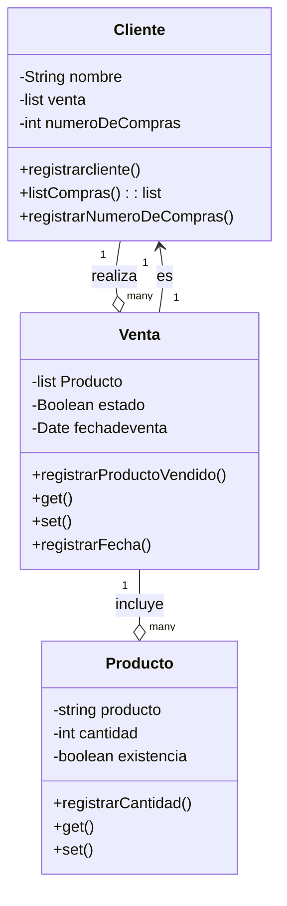

# Ejercicio_Design_Code
Ejercicio entregable para practica diseño y código orientado a objetos
#agrego diagrama Sistema de gestion tienda deportiva:)

```mermaid
classDiagram
    direction TB

    class Cliente {
        -String nombre
        -list venta
        -int numeroDeCompras
        +registrarcliente()
        +listCompras(): list <Venta>
        +registrarNumeroDeCompras()
    }

    class Producto {
        -string producto
        -int cantidad 
        -boolean existencia
        +registrarCantidad()
        +get()
        +set()
    }

    class Venta {
        -list Producto
        -Boolean estado
        -Date fechadeventa
        +registrarProductoVendido()
        +get()
        +set()
        +registrarFecha()
    }

    

    Cliente "1"  --o "many" Venta: realiza
    Venta   "1"  --o "many" Producto: incluye
    Venta   "1" --> "1" Cliente: es
```

